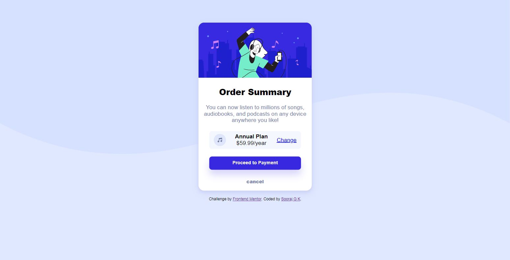
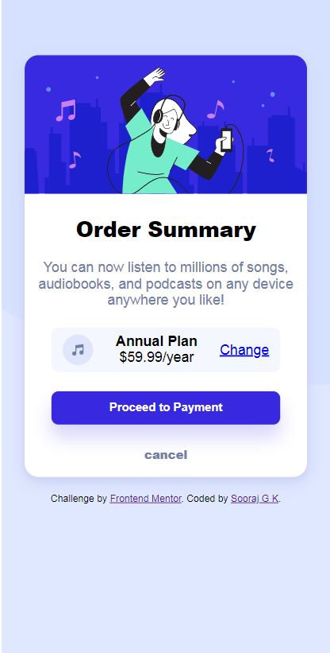

# Frontend Mentor - Order summary card solution

This is a solution to the [Order summary card challenge on Frontend Mentor](https://www.frontendmentor.io/challenges/order-summary-component-QlPmajDUj). Frontend Mentor challenges help you improve your coding skills by building realistic projects.

## Table of contents

- [Overview](#overview)
  - [The challenge](#the-challenge)
  - [Screenshot](#screenshot)
  - [Links](#links)
- [My process](#my-process)
  - [Built with](#built-with)
  - [What I learned](#what-i-learned)
  - [Useful resources](#useful-resources)
- [Author](#author)
-

## Overview

### The challenge

Users should be able to:

- See hover states for interactive elements.
- Will able to view on multiple devices.

### Screenshot

### Links

- Solution URL: [Github](https://github.com/sooraj-studio/Order-Summary-Card-Component)
- Live Site URL: [project](https://clever-archimedes-2c8b22.netlify.app/)

## My process

### Built with

- Semantic HTML5 markup
- CSS3 custom properties
- Flexbox
- Responsive design
- Mobile-first workflow

### What I learned

I had learned how to use box-shadow in a real-world-project and memorized some of the other custom properties and also in responsive.

### Useful resources

- [w3 schools](https://developer.mozilla.org/en-US/)
- [MDN Docs](https://www.w3schools.com/)
- [codepen](https://codepen.io/)

## Author

- Github - [@sooraj-studio](https://github.com/sooraj-studio)
- Frontend Mentor - [@sooraj-studio](https://www.frontendmentor.io/profile/sooraj-studio/)
- Twitter - [@SWings16969796](https://www.twitter.com/@SWings16969796)
